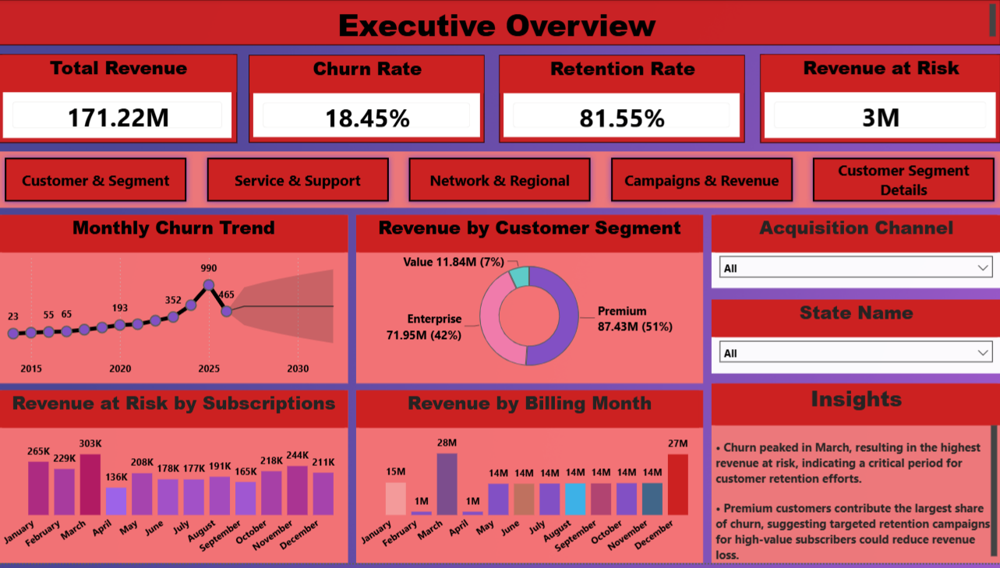
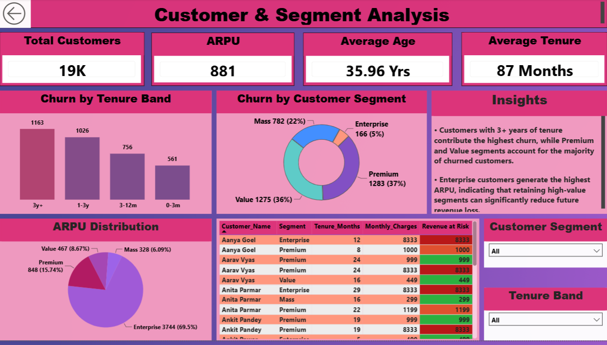
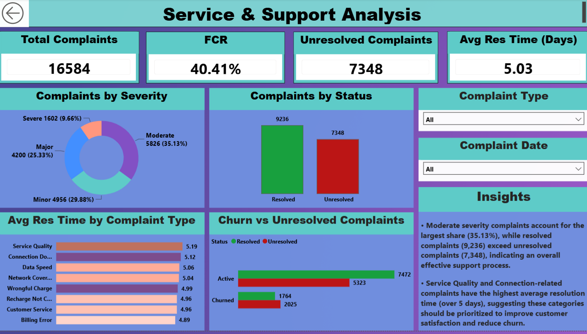
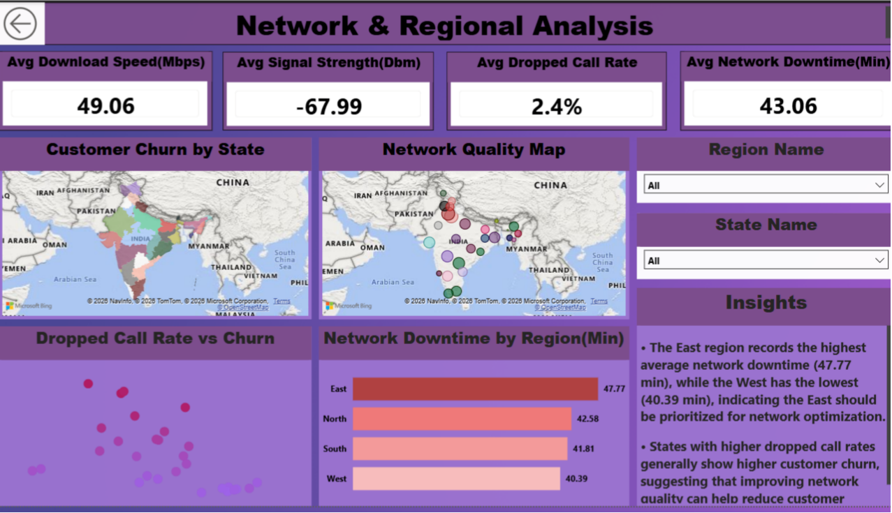
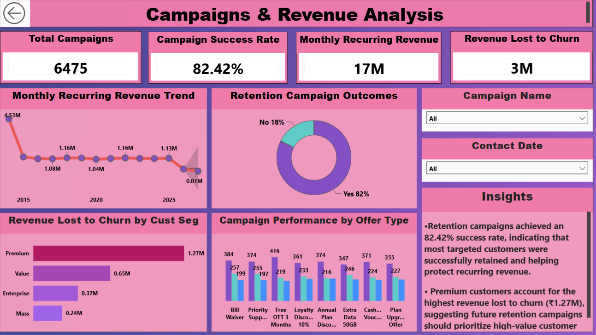
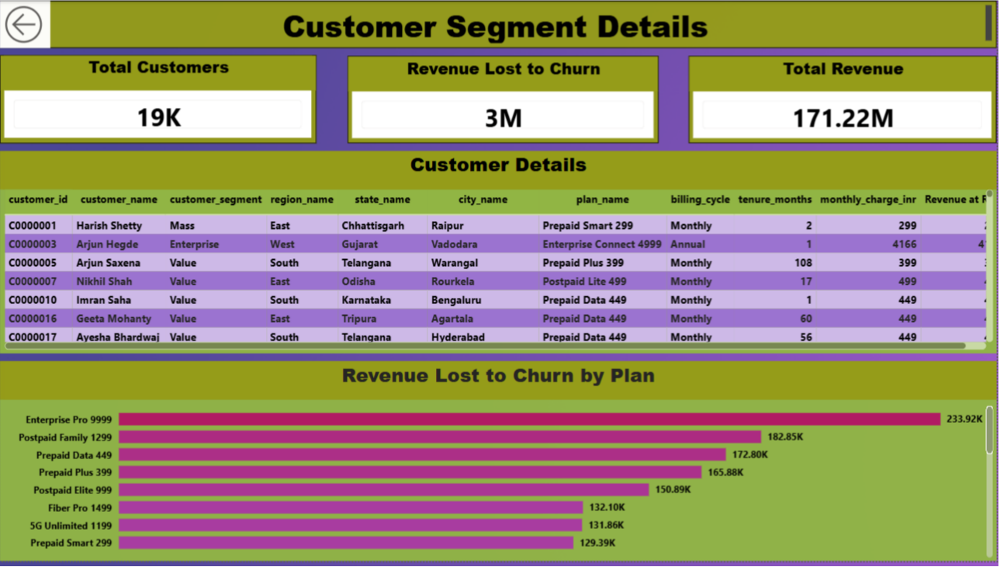

# 📊 NexaTel Customer Churn Analysis

## 📌 Project Overview

Customer churn is one of the biggest challenges for telecom companies because losing existing customers directly impacts recurring revenue and profitability.

This project analyzes customer behavior, service quality, complaints, network performance, billing, and retention campaigns to identify the major drivers of churn and recommend actionable business strategies to improve customer retention.

The project was completed using **Python, Pandas, Power BI, and DAX**, covering the complete analytics workflow from data cleaning to executive dashboard reporting.

---

# 🎯 Objectives

- Analyze customer churn and retention trends.
- Identify high-risk customer segments.
- Measure revenue at risk due to churn.
- Analyze customer complaints and support performance.
- Evaluate network quality across regions.
- Assess retention campaign effectiveness.
- Build interactive dashboards for business decision-making.

---

# 🛠️ Tools & Technologies

- Python
- Pandas
- NumPy
- Jupyter Notebook
- Power BI
- DAX

---

# 📂 Project Structure

```text
NexaTel-Customer-Churn-Analysis/
│
├── Datasets/
│
├── Dashboard_Screenshots/
│   ├── Executive_Overview.png
│   ├── Customer_Segment_Analysis.png
│   ├── Service_Support_Analysis.png
│   ├── Network_Regional_Analysis.png
│   ├── Campaign_Revenue_Analysis.png
│   └── Customer_Segment_Details.png
│
├── Phase1_DataCleaning_Navdeep_Khandelwal.ipynb
├── Phase2_EDA_Navdeep_Khandelwal.ipynb
├── Phase3_KPIs_Navdeep_Khandelwal.ipynb
├── Phase4_Dashboard_Navdeep_Khandelwal.pbix
├── Phase4_Report_Navdeep_Khandelwal.pdf
├── Bonus_Cohort_Analysis_Navdeep_Khandelwal.ipynb
│
└── README.md
```

---

# 📈 Dashboard Pages

## 1️⃣ Executive Overview

This dashboard provides an overall business summary of customer churn and revenue performance.

**KPIs**
- Total Revenue
- Churn Rate
- Retention Rate
- Revenue at Risk

**Visuals**
- Monthly Churn Trend
- Revenue by Customer Segment
- Revenue at Risk by Subscription
- Revenue by Billing Month

### Dashboard Preview



---

## 2️⃣ Customer & Segment Analysis

This dashboard analyzes customer demographics, tenure, customer segments, and revenue contribution.

**KPIs**
- Total Customers
- ARPU
- Average Age
- Average Tenure

**Visuals**
- Churn by Tenure Band
- Churn by Customer Segment
- ARPU Distribution
- Top At-Risk Customers

### Dashboard Preview



---

## 3️⃣ Service & Support Analysis

This dashboard evaluates complaint management and customer support efficiency.

**KPIs**
- Total Complaints
- First Contact Resolution (FCR)
- Unresolved Complaints
- Average Resolution Time

**Visuals**
- Complaints by Severity
- Complaints by Status
- Average Resolution Time by Complaint Type
- Churn vs Unresolved Complaints

### Dashboard Preview



---

## 4️⃣ Network & Regional Analysis

This dashboard analyzes regional network performance and its relationship with customer churn.

**KPIs**
- Average Download Speed
- Average Signal Strength
- Average Dropped Call Rate
- Average Network Downtime

**Visuals**
- Customer Churn by State
- Network Quality Map
- Dropped Call Rate vs Churn
- Network Downtime by Region

### Dashboard Preview



---

## 5️⃣ Campaigns & Revenue Analysis

This dashboard evaluates retention campaign performance and revenue protection.

**KPIs**
- Total Campaigns
- Campaign Success Rate
- Monthly Recurring Revenue (MRR)
- Revenue Lost to Churn

**Visuals**
- Monthly Recurring Revenue Trend
- Retention Campaign Outcomes
- Revenue Lost by Customer Segment
- Campaign Performance by Offer Type

### Dashboard Preview



---

## 6️⃣ Customer Segment Details

A detailed customer-level report for business users.

**Includes**
- Customer Information
- Subscription Details
- Revenue at Risk
- Revenue Lost by Plan

### Dashboard Preview



---

# 📊 Key KPIs

- Total Revenue
- Churn Rate
- Retention Rate
- Revenue at Risk
- ARPU (Average Revenue Per User)
- Average Customer Age
- Average Customer Tenure
- First Contact Resolution (FCR)
- Average Resolution Time
- Complaint Count
- Campaign Success Rate
- Monthly Recurring Revenue (MRR)
- Average Download Speed
- Average Signal Strength
- Average Dropped Call Rate
- Average Network Downtime

---

# ⭐ Bonus Analysis

A **Cohort Retention Analysis** was performed by grouping customers based on their acquisition month and calculating the percentage of customers who remained active after:

- 3 Months
- 6 Months
- 12 Months

This analysis provides additional insights into long-term customer retention patterns across different acquisition cohorts.

---

# 📄 Management Summary Report

A business-focused management report was prepared for the **Chief Customer Officer (CCO)** summarizing:

- Executive Summary
- Top Business Findings
- Risks Identified
- Business Opportunities
- Recommendations

---

# 💡 Key Business Insights

- Premium customers contribute the highest revenue loss due to churn.
- Retention campaigns achieved a success rate of over 82%, demonstrating effective customer engagement.
- Service Quality and Connection-related complaints have the longest average resolution time.
- Regions with higher dropped-call rates generally experience higher customer churn.
- Improving complaint resolution time and network performance can significantly reduce churn and protect recurring revenue.

---

# 👨‍💻 Author

**Navdeep Khandelwal**

**LinkedIn:** https://www.linkedin.com/in/navdeep-khandelwal/

**GitHub:** https://github.com/navdeepkhandelwal

---

⭐ If you found this project helpful, consider giving it a star.
---

# 👨‍💻 Author

**Navdeep Khandelwal**

Data Analyst

- LinkedIn: https://www.linkedin.com/in/navdeep-khandelwal/
- GitHub: https://github.com/navdeepkhandelwal

---

⭐ If you found this project helpful, consider giving it a star.
